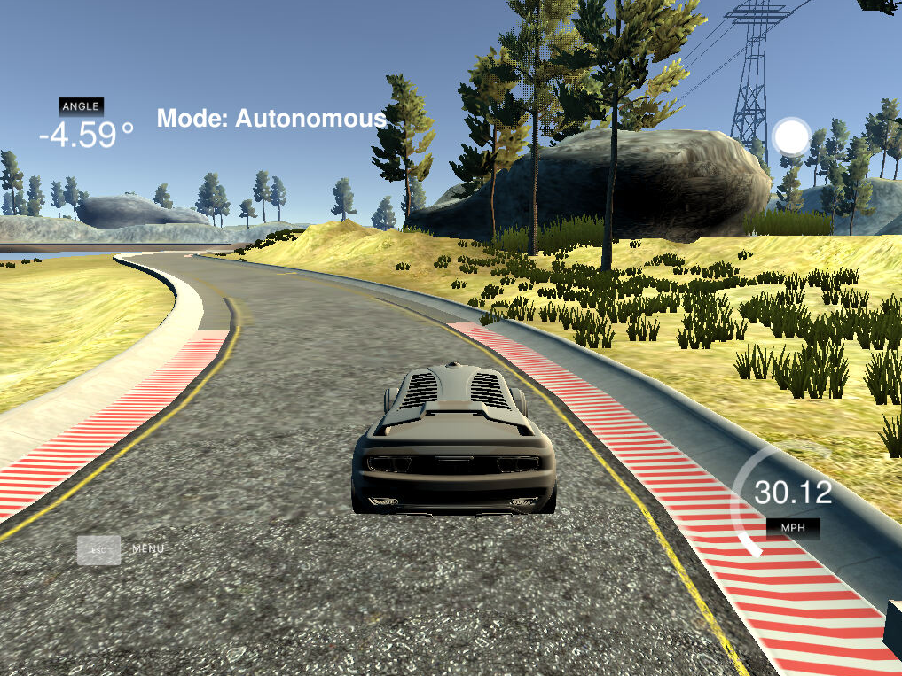

# CarND-Controls-PID
Self-Driving Car Engineer Nanodegree Program

---

## Dependencies

* cmake >= 3.5
 * All OSes: [click here for installation instructions](https://cmake.org/install/)
* make >= 4.1(mac, linux), 3.81(Windows)
  * Linux: make is installed by default on most Linux distros
  * Mac: [install Xcode command line tools to get make](https://developer.apple.com/xcode/features/)
  * Windows: [Click here for installation instructions](http://gnuwin32.sourceforge.net/packages/make.htm)
* gcc/g++ >= 5.4
  * Linux: gcc / g++ is installed by default on most Linux distros
  * Mac: same deal as make - [install Xcode command line tools]((https://developer.apple.com/xcode/features/)
  * Windows: recommend using [MinGW](http://www.mingw.org/)
* [uWebSockets](https://github.com/uWebSockets/uWebSockets)
  * Run either `./install-mac.sh` or `./install-ubuntu.sh`.
  * If you install from source, checkout to commit `e94b6e1`, i.e.
    ```
    git clone https://github.com/uWebSockets/uWebSockets 
    cd uWebSockets
    git checkout e94b6e1
    ```
    Some function signatures have changed in v0.14.x. See [this PR](https://github.com/udacity/CarND-MPC-Project/pull/3) for more details.
* Simulator. You can download these from the [project intro page](https://github.com/udacity/self-driving-car-sim/releases) in the classroom.

Fellow students have put together a guide to Windows set-up for the project [here](https://s3-us-west-1.amazonaws.com/udacity-selfdrivingcar/files/Kidnapped_Vehicle_Windows_Setup.pdf) if the environment you have set up for the Sensor Fusion projects does not work for this project. There's also an experimental patch for windows in this [PR](https://github.com/udacity/CarND-PID-Control-Project/pull/3).

## Basic Build Instructions

1. Clone this repo.
2. Make a build directory: `mkdir build && cd build`
3. Compile: `cmake .. && make`
4. Run it: `./pid`. 

Tips for setting up your environment can be found [here](https://classroom.udacity.com/nanodegrees/nd013/parts/40f38239-66b6-46ec-ae68-03afd8a601c8/modules/0949fca6-b379-42af-a919-ee50aa304e6a/lessons/f758c44c-5e40-4e01-93b5-1a82aa4e044f/concepts/23d376c7-0195-4276-bdf0-e02f1f3c665d)

## Editor Settings

We've purposefully kept editor configuration files out of this repo in order to
keep it as simple and environment agnostic as possible. However, we recommend
using the following settings:

* indent using spaces
* set tab width to 2 spaces (keeps the matrices in source code aligned)

## Code Style

Please (do your best to) stick to [Google's C++ style guide](https://google.github.io/styleguide/cppguide.html).

## Project Instructions and Rubric

Note: regardless of the changes you make, your project must be buildable using
cmake and make!

More information is only accessible by people who are already enrolled in Term 2
of CarND. If you are enrolled, see [the project page](https://classroom.udacity.com/nanodegrees/nd013/parts/40f38239-66b6-46ec-ae68-03afd8a601c8/modules/f1820894-8322-4bb3-81aa-b26b3c6dcbaf/lessons/e8235395-22dd-4b87-88e0-d108c5e5bbf4/concepts/6a4d8d42-6a04-4aa6-b284-1697c0fd6562)
for instructions and the project rubric.

# Reflection

The objective of this project was to implement PID controller for the Udacity Car Simulator, which would drive the vehicle sucessfully around the track. PID controller steers the car proportionally to the Cross Track Error (CTE), which is the lateral distance between a reference path and the actual position of the car. The angle at which the controller steers the car is given by an equasion:

  alpha = - Tau_p * CTE - Tau_d * d/d(t) CTE - Tau_I * sum(CTE)

This equasion can be split into 3 components:

  - (P)roportional component
  - (I)ntegral component
  - (D)erivative component

Each component has different effect on the car behavior.

## Proportional component
This is the proportional steering part of the controller, which actually makes the car steer towards our desired path. It's defined as:

  - Tau_p * CTE

However, by principle, it will always overshoot its target, no matter how big Tau_p is. This will ulitmately end with car oscillating around our desired path. The size of Tau_P will define how quickly will the car react to CTE - the smaller the value, the more slowly will the car steer towards the target path. Also, the oscillation will be smaller. In practice, this component defines how quickly will the car start to steer once it encounters curved road. 

## Derivative component
Helps to notice, that error is being reduced and makes it smaller over time. This allows the car to gracefully approach the desired path. It's defined as:

  - Tau_d * d/d(t) CTE

By finding the right value for Tau_d, we help to minimize overshoot of the car. In practice, improves the steering responsivness of the car. However, no matter how finely we will tune this parameter, if the car has some systematic error in steering, we won't be able to minimize CTE past certain value. 

## Integral component
This component helps to cope with systematic errors in car's steering. This can be projected as how far is the car from the center of road if driving in straight line (but same applies also in curves). It's defined as:

  - Tau_I * sum(CTE)

The value of this component is usually very small, as it's being accumulated over all recorded CTE's. 

## Tuning the parameters
I tuned PID parameters manually by trial and error for this project. The algorithm is following:

  1. Set all constants to 0.
  2. Slowly increase Tau_p, until the car starts to steer meaning fully and oscillate a little on the track.
  3. Slowly increment Tau_d, until the car stops to oscillate too much and starts to respond to curved road nicely.
  4. Repeat steps 2. and 3. to refine the values.
  5. Set Tau_i to a very small value and start to increase it slowly to help the controller to deal with systematic error.
  6. Fine tune all parameters according to following table (Source: Wikipedia):
   


The resulting PID constants were following:

  Tau_p = 0.1
  Tau_i = 0.0005
  Tau_d = 3.2




## Conclusion
The car drives reliably around the track and doesn't leave the driveable surface. However, it's not completely stable and with better tuning we could reach even better performance. There are various methodologies to do that, e.g. using Twiddle algorithm or one of the formula-based aproaches.

## Final note
During PID tuning, I encountered an issue with the simulator itself. When running on my local computer, it behaved in quite unpredictable way each time I ran it, even with the same PID constants. I later figured out this is caused by the speed of my computer, when the simulator produces output too fast for my program to process it. Any change in CPU load changed the behavior of the simulator, thus rendering any PID constants useless. Therefore, I decided to do PID tuning in udacity-provided workspace, where the simulator behaved much more nicely. 